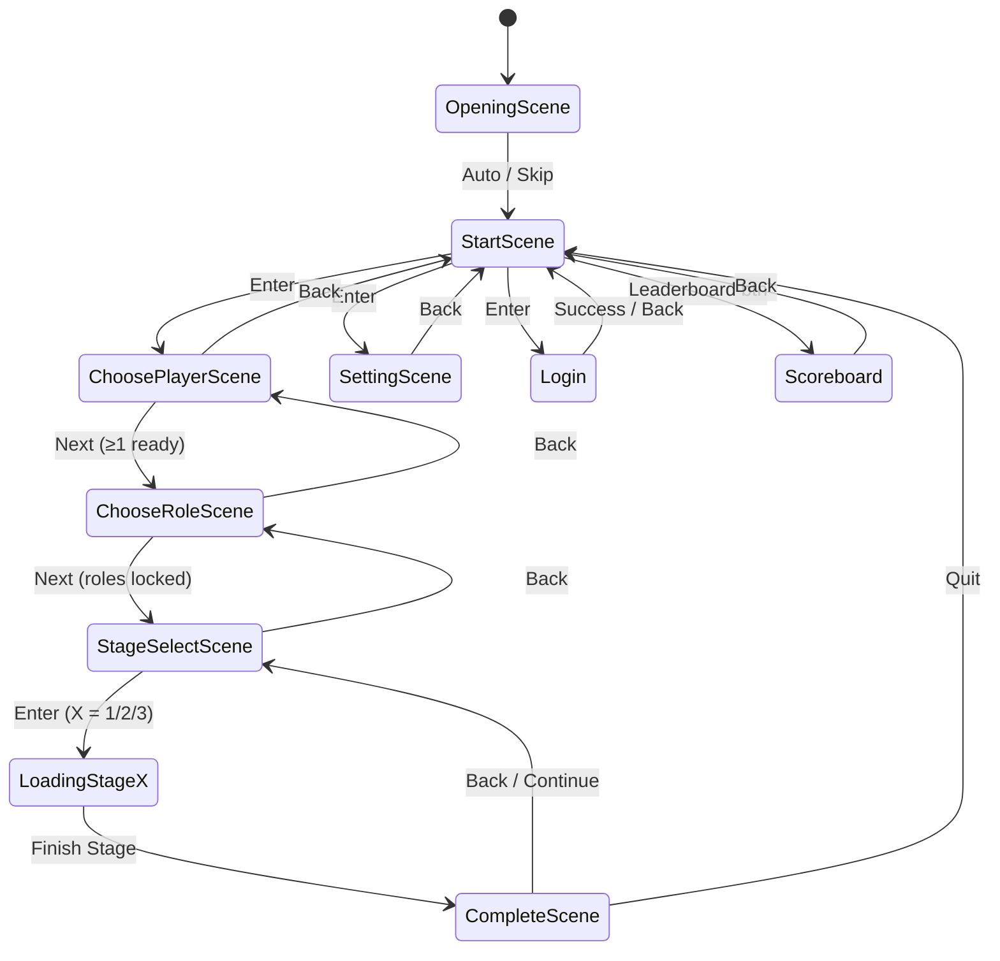

# Running Out of Brain

Fast-paced multiplayer platformer built with Cocos Creator 2.4.8. Supports local multiplayer, stage switching, and Firebase-backed login/leaderboard.

## Demo
- Demo video (YouTube): https://www.youtube.com/watch?v=9KvM9nq_AaU
- Clickable preview: 

## Setup & Build
- Open `RunningOutOfBrain/` in Cocos Creator 2.4.8 (all scenes/assets live under `assets/`).
- Scene files live in `assets/Scene/*.fire` (e.g., `StartScene.fire`, `ChoosePlayerScene.fire`, `StageSelectScene.fire`, `LoadingStage1.fire`).
- For Firebase features, run `npm install` in `RunningOutOfBrain/` once.
- Use the Cocos Play button for local preview. Build to `public/` for web hosting (Firebase `firebase.json` points there).
- Deployed web build: https://sdfinal-project.web.app/

## Core Flow
- OpeningScene → StartScene → ChoosePlayerScene → ChooseRoleScene → StageSelectScene → LoadingStageX → CompleteScene → (back to StageSelectScene or StartScene).
- Settings can be adjusted anytime (audio, speed, lives) and affect the next runs.
- Login/Signup is optional for play but required to write scores to the leaderboard.

Flow diagram (finite-state style; requires Markdown viewers that render Mermaid):

## Scene Guide & Controls
| Scene | What to do | Quick Controls |
| --- | --- | --- |
| Start | Choose next step | `↑/↓` move cursor; `Enter` open item; button for Scoreboard |
| Login / Signup | Sign in or create account | Type email/password; click **Sign In** / **Sign Up** |
| Choose Players | Ready player slots | `Q`/`R`/`U`/`P` toggle 4 seats; **Next** when ≥1 ready |
| Choose Roles | Lock skins | `↑/↓/←/→` move; `Enter` lock; need `max(2, player count)` picks |
| Stage Select | Pick stage | Click stage node or press `1..n`; `Enter` load; **Back** to Roles |
| Settings | Tune audio/difficulty | Drag sliders for BGM/SFX/speed/lives; **Back** to Start |
| Gameplay | Run, swap, shoot | See detailed tables below |
| Complete | Review score | Auto score animation; **Back** to Stage Select |
| Scoreboard | View ranks | Read-only; Back to Start |

### Opening Scene
- Intro scene (auto-advances to StartScene).

### Start
- Navigate with `↑/↓`; `Enter` opens **Choose Players**, **Settings**, or **Login**.
- Leaderboard button opens **Scoreboard**.

### Login / Signup
- Fill email/password; click **Sign In** or **Sign Up** to proceed to the configured next scene.
- Firebase writes/reads user score under `username/<uid>`.

### Choose Players
- Keys `Q` / `R` / `U` / `P` toggle the 4 player slots ready/unready.
- User count updates live; **Next** activates once at least one slot is ready. **Back** returns to Start.

### Choose Roles
- `↑/↓/←/→` to highlight the 2×4 role grid; `Enter` locks a role (each can be picked once).
- You must lock at least `max(2, player count)` roles. **Next** appears when all required slots are filled; **Back** returns to Choose Players.

### Stage Select (StageSelectScene)
- Click a stage node or press number keys `1..n` to focus; camera pans automatically.
- `Enter` loads the highlighted stage (`LoadingStage1/2/3`). **Back** returns to Choose Roles.

### Settings
- Drag sliders to set BGM volume, SFX volume, play speed, and lives (values display beside sliders).
- **Back** returns to Start.

### Gameplay (LoadingStageX)
- Auto-runner: players move forward; camera follows the trailing player. Lives and speed follow Settings. Stars/collectibles and kills feed the score shown later.
- Switching: only one player is the “leading” slot at a time; shooting works for the leading player. Switching has a short cooldown.

#### Keyboard Controls
| Player | Jump | Shoot (when leading) | Bring to Front / Swap |
| --- | --- | --- | --- |
| P1 | `↑` | `↓` | `→` |
| P2 | `W` | `S` | `D` |
| P3 | `T` | `G` | `H` |
| P4 | `I` | `K` | `L` |
| Solo helper | `W` / `D` also act on the non-leading slot so you can swap/jump both when only one player is ready |

#### Xbox / XInput Gamepad Controls (per controller index)
| Controller Index | Jump | Swap to Front | Shoot (when leading) | Notes |
| --- | --- | --- | --- | --- |
| 0 | `Y` (button 3) or D-pad Up (button 12 for solo helper) | `B` (button 1) | `A` (button 0) | Solo: D-pad Up can jump the other slot |
| 1 | `Y` | `B` | `A` | Maps to Player 2 |
| 2 | `Y` | `B` | `A` | Maps to Player 3 |
| 3 | `Y` | `B` | `A` | Maps to Player 4 |

### Complete
- Shows stars earned, per-player kills/deaths, and animates the score. **Back** returns to Stage Select.
- Updates Firebase score for the signed-in user via `username/<uid>/score`.

### Scoreboard
- Displays top scores from Firebase. Back button returns to Start.
